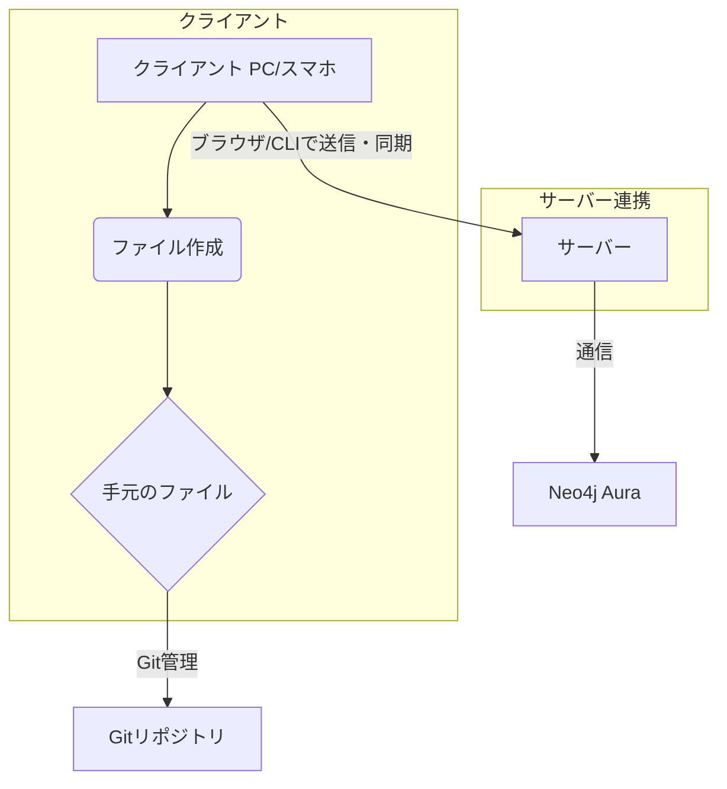

# docs

# / LP

**単文主義**で知識を構造化する新しい時代の知識管理プラットフォーム
- 文章を理解するのって大変！
  - どこまで辿ればいいか分からないwikipediaのリンク地獄
  - 重要な内容がどこにあるか分からない長文
  - これを理解してどこに繋がるのか分からずやる気低下
  - この勉強がどこに繋がるの？現在地が分からない

- 単文主義の革命

長文の否定

- なぜKnowdeなのか
  - 長文の複雑さを排除し、一つの文で一つの概念を表現。理解コストを最小化します。

- 簡単な使い方 2,3行
  - ファイル作成 -> /docs/syntax
  - ファイルアップロード
- 機能箇条書き それぞれの詳細説明 -> /docs/feature/xxx
- 新規登録へ誘導 登録したらできるようになること -> /register
- ログイン -> /login
- 問い合わせフォーム -> /contact
- rootへ -> /

# docs/overview ネットワーク図 サーバーとクライアントの関係

クライアント PC/スマホ で ファイル作成
手元のファイルはGitでも管理できる
ブラウザやCLI からサーバーへ送信・同期
サーバーはグラフデータベースのneo4j Auraと通信

- CLIの立ち位置やユーザー自身がテキストを管理することなどを伝える
- ユーザーの行動を示す UML使うか？
# docs/syntax ファイル形式の説明 ここは頑張って書くべき
- docs/CLI コマンドツールの使い方
  - Get Started
    - さらっと一連の使い方の流れ
    - 詳細は --help で見てくれ と一言
  - リリースページリンク
- docs/feature/#xxx 機能説明 さらっと書く 1ページにまとめる
  - 目次
    - /local
    - /global
    - /sns
    - /extra 関連アプリ

